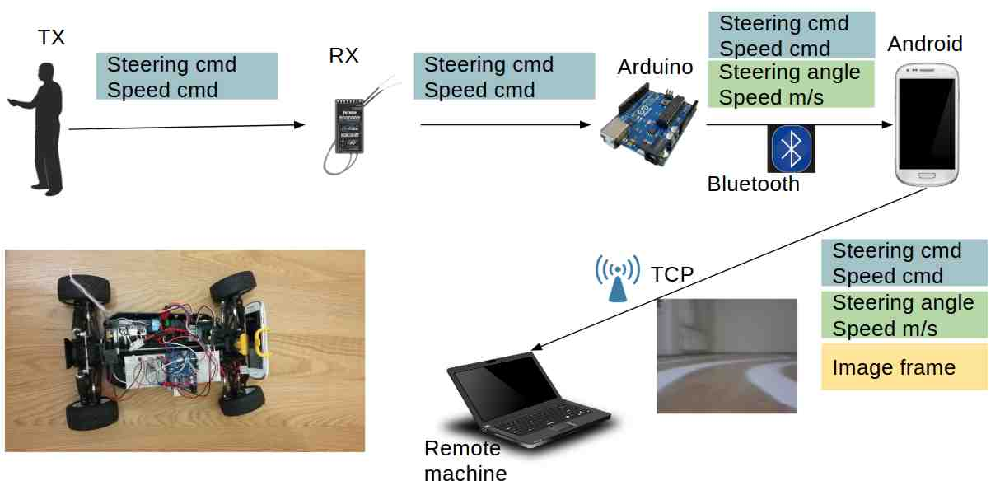
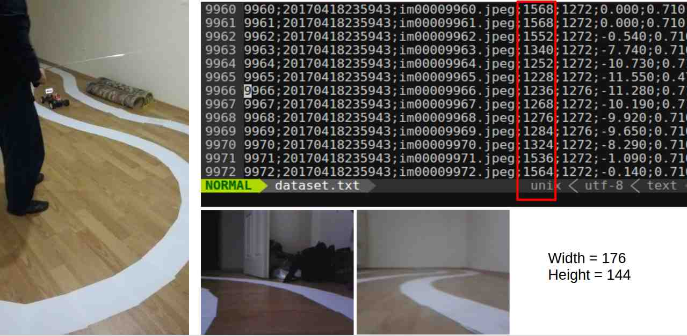

# DRIVERLESS RC CAR


Because real cars are too expensive for self-driving car studies, we are
building a self-driving RC car as a testbed. When you have

- an RC car with a steering servo,
- an Android device with WiFi, Camera and Bluetooth support (we use Samsung
  Galaxy S3 Mini),
- a selfie stick,
- a breadboard and many jumpers,
- an Arduino (we have an Arduino UNO),
- an [HC-06][1] bluetooth module,
- a powerful GPU at your disposal (we use GTX 1070)

you are good to go. We also have a [speed sensor][2], but it is only for
monitoring purposes, you don't need it to train and drive your RC car.

## Data Acquisition

While a human controlling the car through a transmitter, Arduino reads steering
and speed commands, which are essentially servo signals,  from the receiver. It
also computes steering angles (just a linear mapping from steering commands to
angles in degrees) and measures speed in m/s from the speed sensor. Arduino
eventually sends them to the Android device installed on the car. We use
bluetooth for the communication between Arduino and Android.  Android device
attaches a current image frame to the Arduino readings and forwards them all to
a remote machine over TCP/IP. We capture 20 frames per second along with the
Arduino readings. We had to create an access point on the remote machine to make
the communication more reliable.

The figure below demostrates how the data acquisition works.



This is how our dataset looks like. The commands marked in red are the steering
commands. We have speed commands (i.e. throttle) and image file names on the
right and left of the red rectangle, respectively.


A row in `dataset.txt` is as follows:

```
timestep;timestamp;imagefile;steering_cmd;speed_cmd;steering;speed
```


## Teaching a Machine to Steer a Car

You might have heard about Udacity's [open source self-driving car project][3].
They organize various challenges to build the car step by step. [Their steering
control challenge][4] led to brilliant deep learning models and we implemented
[the winner model][5] by Team Komanda for our RC car. It has been a great
starting point for our self-driving RC car journey. It should also be possible
to experiment with other existing steering control models or develop and try
out our own models using our RC car setup.

One difference between our training strategy and original Komanda model is that
we augment our training set by vertically flipping images and mirroring their
corresponding steering commands and angles with respect to the neutral position
before training. We don't use steering angles for training, they are used for
monitoring purposes just like speed values in m/s. Another difference is the
size of input images. Our images have a size of 176x144, which was the minimum
possible image size from our Android device. The model tries to predict both
steering and speed commands given the input images.

You can see the results in the following video.

[](https://youtu.be/3KMKOiGDl7Q)

## Directory Structure

- `carino` contains Arduino-specific code.
- `caroid` contains Android-specific code.
- `station` contains dataset acquisition code and our deep learning agent(s) on
  remote machine side. It also features various visualization tools.

[1]: http://www.robotistan.com/hc06-serial-port-bluetooth-module
[2]: http://www.robotistan.com/motor-hiz-sensoru-1
[3]: https://github.com/udacity/self-driving-car
[4]: https://medium.com/udacity/teaching-a-machine-to-steer-a-car-d73217f2492c
[5]: https://github.com/udacity/self-driving-car/blob/master/steering-models/community-models/komanda/solution-komanda.ipynb
